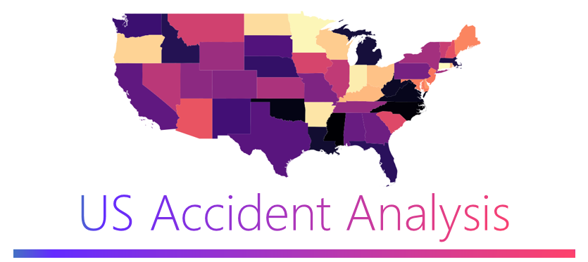

# US Road Accidents Data Analysis

An exploratory data analysis of US road accidents data using Python's data analysis and visualization libraries.



## Table of Contents

- [Introduction](#introduction)
- [Data Preparation and Cleaning](#data-preparation-and-cleaning)
- [Exploratory Analysis and Visualization](#exploratory-analysis-and-visualization)
- [Insights](#insights)
- [Technologies Used](#technologies-used)
- [Getting Started](#getting-started)
- [Usage](#usage)

## Introduction

This project focuses on analyzing and visualizing the US road accidents dataset to gain insights into various aspects of accidents, such as their frequency, severity, time distribution, and geographic distribution. The analysis is performed using Python's data analysis and visualization libraries, including Pandas, Matplotlib, Seaborn, and Plotly.

## Data Preparation and Cleaning

The dataset is loaded using Pandas and cleaned to handle missing and incorrect values. Exploratory analysis is performed to understand the data's structure and identify potential issues.

## Exploratory Analysis and Visualization

The analysis includes:
- Distribution of accidents by city, state, and timezone
- Impact of weather conditions on accidents
- Frequency of accidents by hour, day, month, and year
- Severity of accidents and its impact on traffic
- Geographic distribution of accidents using interactive maps

## Insights

The analysis yields insights such as:
- 50+ Insights 
- Most accident-prone cities and states
- Trends in accidents over the years
- Peak hours and days for accidents

## Technologies Used

- Python
- Pandas
- Matplotlib
- Seaborn
- Plotly
- Jupyter Notebook

## Getting Started

1. Clone the repository:

```bash
git clone https://github.com/your-username/us-road-accidents-analysis.git
```

2. Install the required packages using pip:
```bash
pip install -r requirements.txt
```

3. Run the Jupyter Notebook for detailed analysis:
```bash
jupyter notebook Road_Accidents_Analysis.ipynb
```

## Usage

Feel free to use the analysis and visualization code as a reference for your own projects or to gain insights from the US road accidents dataset.

